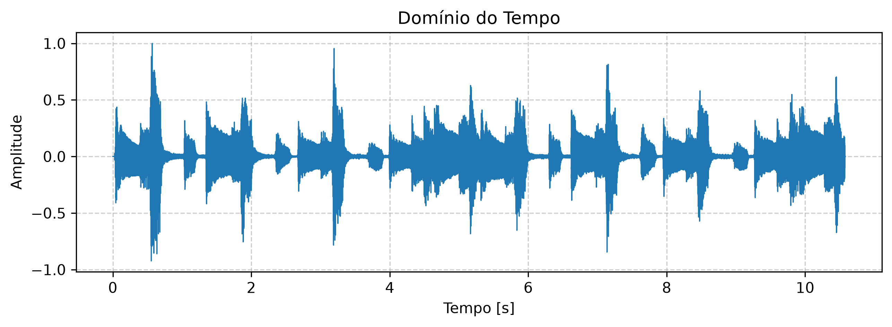
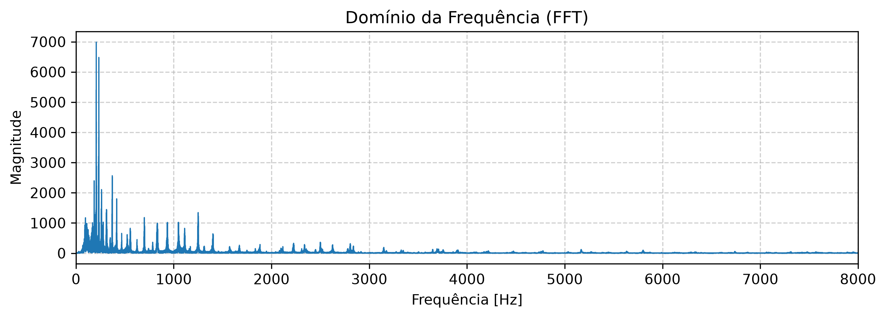
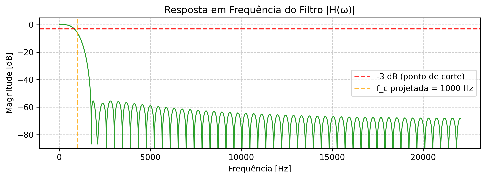
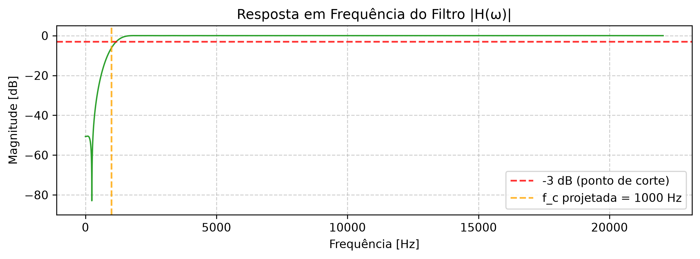
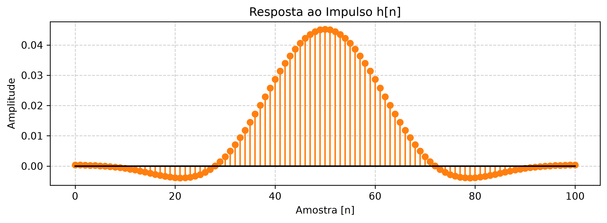
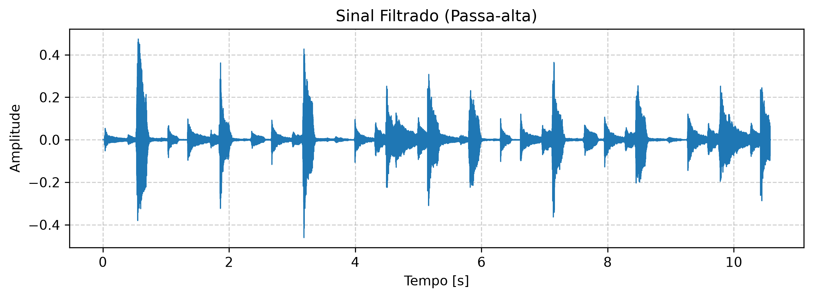
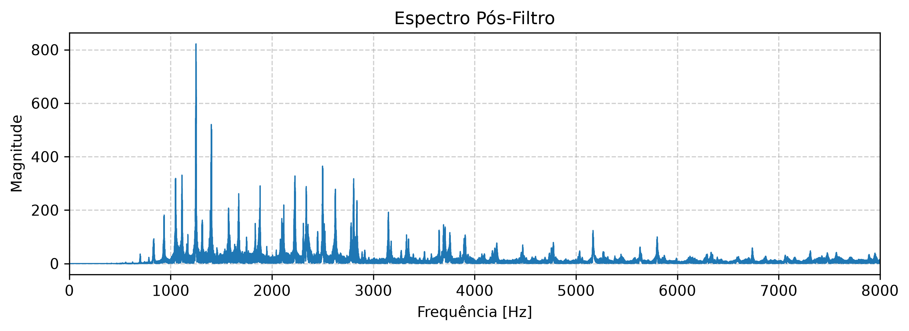

# 🎛️ Analisador Avançado e Filtragem FIR de Áudio

<p align="center">
  
  
  
  
  
</p>

> Aplicação web interativa para **análise espectral** e **filtragem digital FIR** de sinais de áudio, construída com Streamlit e fundamentada em conceitos de **Sistemas Lineares e Invariantes no Tempo (LTI)**.

---

## 📋 Índice

1. [Visão Geral](#-visão-geral)
2. [Fundamentos Teóricos](#-fundamentos-teóricos)
3. [Arquitetura do Sistema](#-arquitetura-do-sistema)
4. [Pré-requisitos](#-pré-requisitos)
5. [Instalação e Execução](#-instalação-e-execução)
6. [Como Usar](#-como-usar)
7. [Resultados e Visualizações](#-resultados-e-visualizações)
8. [Estrutura de Arquivos](#-estrutura-de-arquivos)
9. [Referência Técnica das Funções](#-referência-técnica-das-funções)
10. [Pipeline de Processamento](#-pipeline-de-processamento)
11. [Tecnologias Utilizadas](#-tecnologias-utilizadas)
12. [Licença](#-licença)

---

## 🔍 Visão Geral

Esta aplicação oferece um ambiente interativo completo para o estudo prático de **Processamento Digital de Sinais (PDS)**, cobrindo o ciclo completo de análise e filtragem de sinais de áudio reais:

| # | Funcionalidade | Descrição |
|---|---|---|
| 1 | **Carregamento** | Suporte a arquivos `.wav` mono ou estéreo (estéreo convertido automaticamente para mono) |
| 2 | **Análise Temporal** | Visualização da forma de onda: Amplitude × Tempo |
| 3 | **Análise Espectral** | Espectro de magnitude via FFT: Magnitude × Frequência |
| 4 | **Espectrograma** | Análise tempo-frequência via STFT (mapa de calor em dB) |
| 5 | **Projeto de Filtro** | Filtros FIR (Passa-baixa / Passa-alta) com janela de Hamming |
| 6 | **Inspeção do Filtro** | Visualização de `h[n]` (resposta ao impulso) e `\|H(ω)\|` (resposta em frequência) |
| 7 | **Filtragem** | Aplicação via `filtfilt` para filtragem de **fase zero** |
| 8 | **Avaliação** | Cálculo do **Índice de Preservação do Sinal (IPS)** em dB |
| 9 | **Saída** | Reprodução do áudio filtrado no navegador e download `.wav` |

---

## 📐 Fundamentos Teóricos

### 1. Sistemas LTI (Lineares e Invariantes no Tempo)

Um sistema LTI satisfaz duas propriedades fundamentais:

- **Linearidade (Superposição):** A resposta a uma combinação linear de entradas é a mesma combinação linear das respostas individuais:

$$T\{\alpha \cdot x_1[n] + \beta \cdot x_2[n]\} = \alpha \cdot T\{x_1[n]\} + \beta \cdot T\{x_2[n]\}$$

- **Invariância no Tempo:** Um deslocamento temporal na entrada causa o mesmo deslocamento na saída sem alterar sua forma:

$$T\{x[n - n_0]\} = y[n - n_0]$$

Os filtros FIR implementados nesta aplicação são exemplos clássicos de sistemas LTI, onde a saída é obtida pela **convolução discreta** da entrada com a resposta ao impulso do filtro.

---

### 2. Transformada Rápida de Fourier (FFT)

A FFT é um algoritmo eficiente para calcular a **Transformada Discreta de Fourier (DFT)**, que decompõe um sinal no domínio do tempo em suas componentes de frequência:

$$X[k] = \sum_{n=0}^{N-1} x[n] \cdot e^{-j \cdot 2\pi \cdot k \cdot n / N}, \quad k = 0, 1, \ldots, N-1$$

Onde:
- `x[n]` — sinal no domínio do tempo com `N` amostras
- `X[k]` — coeficiente espectral na frequência `k·fs/N`
- `N` — número total de amostras

> **Nota:** A aplicação exibe apenas as **frequências positivas** (0 a `fs/2`), pois para sinais reais o espectro é simétrico conjugado — propriedade conhecida como simetria Hermitiana.

---

### 3. Filtro FIR (Finite Impulse Response)

Um filtro FIR possui resposta ao impulso de duração finita. A saída é calculada por convolução discreta:

$$y[n] = \sum_{k=0}^{M-1} h[k] \cdot x[n-k]$$

Onde:
- `h[k]` — coeficientes (taps) do filtro, equivalentes à resposta ao impulso `h[n]`
- `M` — número de coeficientes; a ordem do filtro é `M − 1`
- A operação é uma **convolução linear discreta**

**Vantagens dos filtros FIR em relação aos IIR:**

| Propriedade | Filtro FIR | Filtro IIR |
|---|---|---|
| **Estabilidade** | ✅ Sempre estável (polos na origem) | ⚠️ Pode ser instável |
| **Fase** | ✅ Fase linear exata (com simetria) | ❌ Fase não linear |
| **Custo computacional** | ⚠️ Ordem elevada para transições abruptas | ✅ Ordens menores |
| **Projeto** | ✅ Simples e previsível | ⚠️ Mais complexo |

---

### 4. Janela de Hamming

O projeto do filtro utiliza a **janela de Hamming** para suavizar os coeficientes e reduzir o fenômeno de *ripple* (ondulações) na banda de rejeição:

$$w[n] = 0{,}54 - 0{,}46 \cdot \cos\!\left(\frac{2\pi n}{M-1}\right), \quad n = 0, 1, \ldots, M-1$$

A janela de Hamming oferece atenuação mínima de **~41 dB** na banda de rejeição, com uma transição mais suave em comparação à janela retangular (que produziria o **fenômeno de Gibbs**).

---

### 5. Resposta em Frequência H(ω)

A resposta em frequência de um filtro FIR é obtida pela DTFT da resposta ao impulso `h[n]`:

$$H(\omega) = \sum_{n=0}^{M-1} h[n] \cdot e^{-j\omega n}$$

A magnitude é exibida em decibéis (dB):

$$|H(\omega)|_{dB} = 20 \cdot \log_{10}(|H(\omega)| + \varepsilon)$$

> **Importante:** A função `scipy.signal.firwin` define a frequência de corte no ponto de **meia amplitude (−6 dB)**. Por isso, no gráfico, a curva cruza a frequência de projeto em torno de −6 dB, enquanto a linha de −3 dB serve apenas como nível de referência padrão.

---

### 6. Espectrograma via STFT

O espectrograma é obtido pela **Short-Time Fourier Transform (STFT)**, que aplica a FFT em janelas temporais deslizantes ao longo do sinal:

$$\text{STFT}\{x[n]\}(m, \omega) = \sum_{n=-\infty}^{\infty} x[n] \cdot w[n - m] \cdot e^{-j\omega n}$$

O resultado é um mapa tempo-frequência que revela como a distribuição de energia espectral varia ao longo do tempo.

---

### 7. Índice de Preservação do Sinal (IPS)

A métrica calculada pela aplicação quantifica o quanto a filtragem preservou o conteúdo espectral do sinal:

$$\text{IPS}_{dB} = 10 \cdot \log_{10}\!\left(\frac{P_{\text{filtrado}}}{P_{\text{removido}}}\right)$$

Onde:
- `P_filtrado` = potência média do sinal após a filtragem: $\frac{1}{N}\sum y[n]^2$
- `P_removido` = potência média da diferença: $\frac{1}{N}\sum (x[n] - y[n])^2$

> **Interpretação:** Esta métrica **não** representa o SNR tradicional (sinal vs. ruído de fundo). Ela mede o quanto o filtro alterou o sinal original. Valores elevados indicam que a maior parte da energia foi preservada; valores baixos são esperados quando o filtro remove uma faixa espectral significativa (ex.: passa-alta com corte elevado).

---

## 🏗️ Arquitetura do Sistema

A aplicação adota arquitetura em **duas camadas** com separação clara de responsabilidades:

```
┌──────────────────────────────────────────────────────────────┐
│                     app.py  (Camada de UI)                   │
│                                                              │
│  ┌──────────────┐  ┌──────────────────────┐  ┌───────────┐  │
│  │  Upload .wav  │  │ Controles Interativos │  │ Matplotlib│  │
│  │              │  │ Tipo | Corte | Ordem  │  │  Figures  │  │
│  └──────┬───────┘  └──────────┬───────────┘  └─────▲─────┘  │
│         │                     │                     │        │
│         │      ┌──────────────▼─────────────┐       │        │
│         │      │    Cache (@st.cache_data)   │       │        │
│         │      │  load_and_process_audio()  │       │        │
│         │      │  get_filter_design()       │       │        │
│         │      │  process_filter()          │       │        │
│         │      └──────────────┬─────────────┘       │        │
└─────────┼─────────────────────┼─────────────────────┼────────┘
          │                     │                     │
          ▼                     ▼                     │
┌──────────────────────────────────────────────────────────────┐
│            signal_processing.py  (Camada Lógica)             │
│                                                              │
│  ┌───────────────────┐      ┌────────────────────────────┐   │
│  │  normalize_signal │      │    design_fir_filter       │   │
│  │  compute_fft      │      │    apply_fir_filter        ├───┘
│  │                   │      │  compute_frequency_response│
│  └───────────────────┘      │    calculate_snr           │
│          NumPy              └────────────────────────────┘
│                                        SciPy              │
└──────────────────────────────────────────────────────────────┘
```

| Camada | Arquivo | Responsabilidade |
|---|---|---|
| **Interface (UI)** | `app.py` | Upload, controles interativos, renderização de gráficos, cache Streamlit, reprodução e download de áudio |
| **Lógica Matemática** | `signal_processing.py` | Normalização, FFT, projeto e aplicação de filtros FIR, resposta em frequência, IPS |

---

## ✅ Pré-requisitos

- **Python** 3.8 ou superior
- **pip** (gerenciador de pacotes Python)
- Navegador web moderno (Chrome, Firefox, Edge ou Safari)

---

## 🚀 Instalação e Execução

### 1. Clonar o repositório

```bash
git clone https://github.com/HachemAhmed/signal-processing-app.git
cd signal-processing-app
```

### 2. Criar e ativar ambiente virtual (recomendado)

```bash
# Linux / macOS
python3 -m venv venv
source venv/bin/activate

# Windows
python -m venv venv
venv\Scripts\activate
```

### 3. Instalar dependências

```bash
pip install -r requirements.txt
```

### 4. Executar a aplicação

```bash
streamlit run app.py
```

A aplicação será iniciada e abrirá automaticamente no navegador em:

```
http://localhost:8501
```

---

## 🖥️ Como Usar

### Passo 1 — Carregar o áudio
Clique em **"Browse files"** e selecione um arquivo `.wav`. A aplicação aceita arquivos **mono ou estéreo** (estéreo é convertido automaticamente para mono pela média dos canais).

### Passo 2 — Analisar o sinal original
Após o upload, a aplicação exibe automaticamente:
- **Player de áudio** integrado ao navegador
- **Domínio do Tempo:** gráfico Amplitude × Tempo do sinal completo
- **Domínio da Frequência (FFT):** Magnitude × Frequência com limite de eixo ajustável na barra lateral
- **Espectrograma (STFT):** mapa de calor em dB mostrando a evolução temporal das frequências

### Passo 3 — Projetar o filtro
Configure os parâmetros na **Seção 2**:

| Parâmetro | Opções | Efeito |
|---|---|---|
| **Tipo** | `Passa-baixa` / `Passa-alta` | Define qual faixa espectral é preservada |
| **Frequência de Corte** | 100 Hz → `fs/2 − 100` Hz | Define a fronteira da banda passante |
| **Ordem (N° de coeficientes)** | 51, 101, 151, 201, 251 | Maior ordem → transição mais abrupta, maior custo computacional |

A interface atualiza automaticamente:
- **`|H(ω)|` em dB** com marcadores em −3 dB e na frequência de corte projetada
- **`h[n]`** — resposta ao impulso discreta (os coeficientes do filtro FIR)

### Passo 4 — Avaliar o resultado
A **Seção 3** exibe:
- **Índice de Preservação do Sinal (IPS)** em dB
- Sinal filtrado no domínio do tempo e da frequência
- **Player de áudio** com o resultado filtrado
- Botão **"⬇️ Baixar Áudio Filtrado (.wav)"**

---

## 📊 Resultados e Visualizações

As figuras a seguir foram geradas pela própria aplicação com um sinal de guitarra acústica real (arquivo `.wav` incluído no repositório).

### Sinal Original — Domínio do Tempo



*Forma de onda normalizada no intervalo [−1, 1]. Os picos de amplitude correspondem aos ataques das cordas.*

---

### Sinal Original — Espectro FFT



*Espectro de magnitude mostrando a distribuição de energia nas componentes de frequência do sinal.*

---

### Resposta em Frequência do Filtro |H(ω)|

**Passa-baixa (f_c = 1000 Hz, 101 taps):**



**Passa-alta (f_c = 1000 Hz, 101 taps):**



*A linha tracejada vermelha indica o nível de referência −3 dB. A linha laranja marca a frequência de corte projetada. A curva cruza a frequência de projeto em ~−6 dB, conforme convenção do `firwin`.*

---

### Resposta ao Impulso h[n]



*Coeficientes do filtro FIR (janela de Hamming). A simetria em torno do ponto central garante fase linear exata.*

---

### Resultado da Filtragem — Passa-Alta (f_c = 1000 Hz)

**Domínio do Tempo:**



**Espectro Pós-Filtro:**



*Após a filtragem passa-alta com corte em 1000 Hz, o conteúdo de graves é atenuado, preservando as componentes de alta frequência.*

---

## 📁 Estrutura de Arquivos

```
signal-processing-app/
├── app.py                   # Camada de apresentação — interface Streamlit
├── signal_processing.py     # Camada lógica — funções de PDS (NumPy + SciPy)
├── requirements.txt         # Dependências do projeto
├── audio/
│   └── *.wav                # Arquivo de áudio de exemplo
├── images/
│   └── *.png                # Gráficos exportados pela aplicação (300 DPI)
└── README.md                # Esta documentação
```

---

## 📖 Referência Técnica das Funções

### `signal_processing.py`

#### `normalize_signal(data: np.ndarray) → np.ndarray`

Converte o array para `float64` e normaliza a amplitude para o intervalo `[−1, 1]`, prevenindo distorções (*clipping*) e garantindo compatibilidade com entradas inteiras (`int16`, `int32`) ou de ponto flutuante.

| Parâmetro | Tipo | Descrição |
|---|---|---|
| `data` | `np.ndarray` | Vetor de amostras (qualquer dtype numérico) |
| **Retorno** | `np.ndarray (float64)` | Sinal normalizado em `[−1, 1]` |

---

#### `compute_fft(data: np.ndarray, fs: int) → tuple`

Calcula a FFT do sinal e retorna apenas as frequências positivas e suas magnitudes (aproveitando a simetria Hermitiana de sinais reais).

| Parâmetro | Tipo | Descrição |
|---|---|---|
| `data` | `np.ndarray` | Vetor de amostras do sinal |
| `fs` | `int` | Frequência de amostragem (Hz) |
| **Retorno** | `tuple(np.ndarray, np.ndarray)` | `(frequências_Hz, magnitudes)` |

---

#### `design_fir_filter(fs, cutoff, filter_type, numtaps=101) → np.ndarray`

Projeta o filtro FIR com janela de Hamming via `scipy.signal.firwin` e retorna os coeficientes `h[n]`. Separado de `apply_fir_filter` para permitir cache e visualização independentes da filtragem.

| Parâmetro | Tipo | Descrição |
|---|---|---|
| `fs` | `int` | Frequência de amostragem (Hz) |
| `cutoff` | `float` | Frequência de corte (Hz) |
| `filter_type` | `str` | `"Passa-baixa"` ou `"Passa-alta"` |
| `numtaps` | `int` | Número de coeficientes (default: 101) |
| **Retorno** | `np.ndarray` | Coeficientes `h[n]` do filtro FIR |

---

#### `apply_fir_filter(data, fs, cutoff, filter_type, numtaps=101) → np.ndarray`

Aplica o filtro FIR ao sinal usando `scipy.signal.filtfilt` para **filtragem de fase zero** — o sinal é filtrado nos dois sentidos (ida e volta), eliminando qualquer distorção de fase.

| Parâmetro | Tipo | Descrição |
|---|---|---|
| `data` | `np.ndarray` | Sinal de entrada |
| `fs` | `int` | Frequência de amostragem (Hz) |
| `cutoff` | `float` | Frequência de corte (Hz) |
| `filter_type` | `str` | `"Passa-baixa"` ou `"Passa-alta"` |
| `numtaps` | `int` | Número de coeficientes (default: 101) |
| **Retorno** | `np.ndarray` | Sinal filtrado com fase zero |

---

#### `compute_frequency_response(taps, fs) → tuple`

Calcula a resposta em frequência `H(ω)` em dB usando 8192 pontos para alta resolução espectral.

| Parâmetro | Tipo | Descrição |
|---|---|---|
| `taps` | `np.ndarray` | Coeficientes `h[n]` do filtro FIR |
| `fs` | `int` | Frequência de amostragem (Hz) |
| **Retorno** | `tuple(np.ndarray, np.ndarray)` | `(frequências_Hz, magnitude_dB)` |

---

#### `calculate_snr(original, filtered) → float`

Calcula o Índice de Preservação do Sinal (IPS) em dB entre o sinal original e o filtrado.

| Parâmetro | Tipo | Descrição |
|---|---|---|
| `original` | `np.ndarray` | Sinal antes da filtragem |
| `filtered` | `np.ndarray` | Sinal após a filtragem |
| **Retorno** | `float` | IPS em dB. Retorna `inf` se o filtro não alterou o sinal. |

---

### `app.py` — Funções com Cache

| Função | Decorator | Descrição |
|---|---|---|
| `load_and_process_audio(uploaded_file)` | `@st.cache_data` | Lê o `.wav`, converte estéreo → mono e normaliza. Cache evita releitura a cada interação. |
| `get_filter_design(fs, cutoff, filter_type, numtaps)` | `@st.cache_data` | Wrapper cacheado para `design_fir_filter`. Permite renderizar `h[n]` e `H(ω)` sem recalcular coeficientes. |
| `process_filter(data, fs, cutoff, filter_type, numtaps)` | `@st.cache_data` | Wrapper cacheado para a convolução FIR. Evita recalcular a operação mais pesada a cada rerun. |

---

## ⚙️ Pipeline de Processamento

```
Upload .wav
    │
    ▼
┌───────────────────────────┐
│ 1. scipy.io.wavfile.read  │
│ 2. Estéreo → Mono         │  data.mean(axis=1)
│ 3. Cast → float64         │  data.astype(np.float64)
│ 4. Normalização [-1, 1]   │  data / max(|data|)
└─────────────┬─────────────┘
              │
     ┌────────┴────────┐
     ▼                 ▼
┌─────────┐      ┌──────────────┐
│   FFT   │      │     STFT     │
│ np.fft  │      │ spectrogram()│
└────┬────┘      └──────┬───────┘
     │                  │
     ▼                  ▼
 Espectro         Espectrograma
 de Magnitude     Tempo-Frequência
                  │
                  ▼
┌────────────────────────────────┐
│ 5. design_fir_filter()        │
│    firwin() + Hamming → h[n]  │
├────────────────┬───────────────┤
│                ▼               │
│  compute_frequency_response() │
│  → |H(ω)| em dB               │
└────────────────┬───────────────┘
                 │
                 ▼
┌────────────────────────────────┐
│ 6. apply_fir_filter()         │
│    filtfilt → fase zero        │
│ 7. np.clip(filtered, -1, 1)   │  Anti-clipping
│ 8. calculate_snr()             │  IPS em dB
└────────────────┬───────────────┘
                 │
        ┌────────┴────────┐
        ▼                 ▼
    Gráfico            Áudio
    Filtrado           Filtrado
    (Tempo + FFT)      + Download .wav
```

---

## 🛠️ Tecnologias Utilizadas

| Tecnologia | Versão | Propósito |
|---|---|---|
| [**Python**](https://www.python.org/) | ≥ 3.8 | Linguagem de programação base |
| [**Streamlit**](https://streamlit.io/) | Latest | Framework web para dashboards científicos interativos |
| [**NumPy**](https://numpy.org/) | Latest | Computação numérica vetorizada, FFT (`np.fft`) |
| [**SciPy**](https://scipy.org/) | Latest | Projeto de filtros FIR (`firwin`), filtragem de fase zero (`filtfilt`), resposta em frequência (`freqz`), leitura de `.wav` (`wavfile`), espectrograma (`spectrogram`) |
| [**Matplotlib**](https://matplotlib.org/) | Latest | Renderização de gráficos, espectrogramas, respostas ao impulso e em frequência |

---

## 📄 Licença

Este projeto é de uso **acadêmico e educacional**, desenvolvido como ferramenta didática para o estudo de **Processamento Digital de Sinais** e **Sistemas Lineares e Invariantes no Tempo (LTI)**.

---

<p align="center">
  <sub>Desenvolvido como ferramenta didática para estudo de Processamento Digital de Sinais e Sistemas LTI.</sub>
</p>